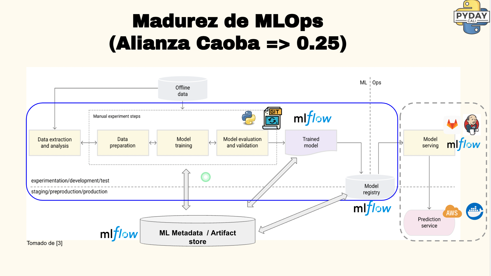

# PyDay Cali  Demo (Getting started with MLOps with MLflow on-premises)

- 💼 [LinkedIn](https://www.linkedin.com/in/kamymartinez/)
- 🐦 [Twitter](https://twitter.com/KamyBytes)

>Note: If you are interested in deploying MLflow in AWS, you can check [Implementing MLflow in your ML experiments at low cost from EC2](https://github.com/KamyNz/awscomunityday2023/tree/main)

## Introduction

This repository contains the necessary information to follow the demo from the presentation **Getting started with MLOps with MLflow on-premises** in the context of the [PyDay Cali](https://calidev.co/eventos/pyday/cali-2023/) event.

- ▶️[YoutubeVideo-Presentation-in-Spanish](https://youtu.be/cEpjQGdwMJQ?t=1955)

> **Note: The repository is structured into various sections for the installation and configuration of MLflow. You should read other relevant prerequisites before you begin!**

## Relevant Prerequisites
- [Follow these instructions to generate environment](https://docs.google.com/document/d/1cKt_1HJ4R_A4a8m9L3SW7RYCPYqYkyrUGv_dk4XTB8c/edit?usp=sharing)
- A python=3.10 environment
- [Run cells of Jupyter Notebook in repo](./use_case/notebook/MLflow_Local.ipynb)
- [PowerPoint-Presentation-in-Spanish](https://docs.google.com/presentation/d/1B4s1wYS_IuFgmeCPmgrnu1IGfCIbPvm7DJwaLaY-S_k/edit?usp=sharing)

## Key Audience
- Data science teams looking to take their first steps in enhancing ML processes
- Individuals with a Data Scientist role that are interested in MLOPs
- Individuals with a Data Engineer role that are interested in MLOPs
- Individuals with an ML Engineer role that are interested in MLOPs
- Any other role seeking practical experience for tracking parameters and artifacts related to managing machine learning models.

## Goals
- Introduction to MLOps
- Introduction to MLflow
- Interaction with MLflow from localhost

## Demo Scenario
> **Note: Read the following before you begin!**

An analytics team wants to start implementing an MLOps culture. Therefore, along with their technical leader, they are going to set up a tracking server using [MLflow](https://mlflow.org/docs/latest/getting-started/index.html) on localhost because they are checking out MLflow as their MLOPs tool.

Similarly, the technical leader of the analytics team aims to streamline the compilation of the library of experiments that team members have been generating in Python scripts or Jupyter notebooks on their personal computers.

## Repository Structure
> Note: This is the repository structure from the root

- `README.md` > README with instructions for using this repository
- `use_case` > XX
   - `use_case/config` > XX
   - `use_case/data` > XX
   - `use_case/src` > XX
- `docs` > Supplementary information about the repository

## Pre-Learning

- [Introduction to Git](https://www.youtube.com/watch?v=uR6G2v_WsRA&ab_channel=DavidMahler)

## Tips
- [Tips](https://docs.google.com/document/d/1cKt_1HJ4R_A4a8m9L3SW7RYCPYqYkyrUGv_dk4XTB8c/edit?usp=sharing)

## Learnings and Next Steps

- To fill later ;)

## Contributing

Contributions to this repository are welcome! If you'd like to contribute, please follow these guidelines:

1. **Fork the Repository**: Click the "Fork" button at the top right corner of this repository to create your copy.

2. **Make Changes**: Create a new branch on your fork, make changes or additions to the materials, and commit your changes.

3. **Submit a Pull Request**: Once you're satisfied with your changes, submit a pull request. Be sure to provide a clear and concise description of your changes.

4. **Review and Collaborate**: Collaborators will review your pull request, provide feedback, and merge it into the main repository if everything looks good.

Please follow good coding practices and ensure that your contributions align with the purpose of this repository.

## License

This repository is licensed under the [MIT License](LICENSE). Please review the license before using or contributing to this repository.

## Acknowledgments

- [Diego Marulanda](https://www.linkedin.com/in/diegomarulandabarrientos/): Attending my presentation and providing feedback.

